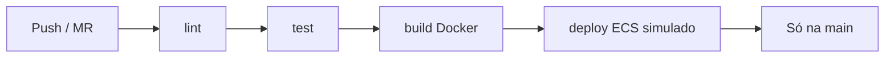

# TesteTraineeCrawler

Scraper em **Node.js + TypeScript** para o desafio técnico **Crawler/RPA & IA** (IN8 / Devnology).

Coleta dados de [books.toscrape.com](https://books.toscrape.com), persiste em JSON/CSV e roda em pipeline **GitLab CI/CD** com imagem **Docker**.

---

## Pré-requisitos

- **Node.js 20+**
- **Docker Desktop** (opcional, para execução containerizada)

---

## Como rodar

### Localmente (sem Docker)

```bash
npm install
npm run check          # typecheck + lint + testes
npm run build && npm start
```

Arquivos gerados em `output/`:

- `books.json` — ~1000 livros
- `books.csv` — mesma base em formato tabular

### Com Docker

```bash
# Build da imagem
docker build -t teste-trainee-crawler .

# Execução (monta output/ local para persistir os arquivos)
docker run --rm -v "${PWD}/output:/app/output" teste-trainee-crawler
```

No PowerShell (Windows), o volume funciona da mesma forma:

```powershell
docker run --rm -v "${PWD}/output:/app/output" teste-trainee-crawler
```

**Comportamento esperado:** o container executa o scraper, imprime `Scraping concluído: 1000 livros salvos em output/` e **encerra**. Com `--rm`, o container some após terminar — isso é normal para um job batch.

### Com classificação IA (bônus, opcional)

Requer chave de API OpenAI (ou compatível). Copie `.env.example` → `.env` e configure:

```bash
ENABLE_AI_CLASSIFIER=true
OPENAI_API_KEY=sk-...
AI_MAX_BOOKS=5   # limita livros enriquecidos por execução (padrão: 5)
```

```bash
npm run build && npm start
```

O scraper coleta ~1000 livros normalmente e enriquece os **primeiros N** (`AI_MAX_BOOKS`) visitando a página de detalhe, extraindo a descrição em texto livre e usando um LLM para inferir `genres` e `summary`. Sem `OPENAI_API_KEY`, o enriquecimento é ignorado com aviso no log.

### Com browser automation (bônus, opcional)

O site [books.toscrape.com](https://books.toscrape.com) é **HTML estático** — o scraper principal usa **Cheerio + axios** e não precisa de browser headless. Este bônus demonstra capacidade com **Playwright** para catálogos renderizados por JavaScript (infinite scroll, botão “load more”, etc.).

Instale browsers do Playwright uma vez (dev):

```bash
npx playwright install chromium
```

Demo com fixture local (`tests/fixtures/dynamic-catalog.html` — simula JS + load-more):

```bash
npm run scrape:browser-demo
```

Saída esperada: 3 livros extraídos após o browser clicar/scrollar até carregar todos os batches.

Para apontar outra URL dinâmica:

```bash
BROWSER_SCRAPER_URL=https://exemplo.com/catalogo-dinamico npm run scrape:browser-demo
```

O módulo `src/browserScraper.ts` fica **separado** do pipeline principal (`npm start`). Testes no CI usam mocks — não baixam browser nem acessam sites externos.

---

## Estrutura do projeto

```
src/
  index.ts         # orquestra scrape → JSON → CSV
  scraper.ts       # HTTP, paginação, delay
  parser.ts        # extração com Cheerio
  saveJson.ts      # persistência JSON
  saveCsv.ts       # persistência CSV
  types.ts         # schema Book e config
  aiClassifier.ts  # bônus LLM — classifica descrições (opcional via env)
  browserScraper.ts # bônus Playwright — catálogos dinâmicos (opcional)
  browserDemo.ts    # demo local com fixture HTML (npm run scrape:browser-demo)
tests/
  scraper.test.ts  # parser, exportação e paginação mockada
  browserScraper.test.ts # Playwright mockado (sem browser real no CI)
  fixtures/
    dynamic-catalog.html # página JS simulada (load-more / scroll)
output/            # build compilado + dados gerados
Dockerfile
.dockerignore
.gitlab-ci.yml
```

---

## Schema dos dados

Cada livro segue a interface `Book`:

| Campo            | Tipo        | Descrição                                        |
| ---------------- | ----------- | ------------------------------------------------ |
| `title`          | `string`    | Título do livro                                  |
| `price`          | `number`    | Preço numérico (ex.: `51.77`)                    |
| `priceFormatted` | `string`    | Preço original com símbolo (ex.: `£51.77`)       |
| `rating`         | `number`    | Estrelas de 1 a 5 (0 se ausente)                 |
| `availability`   | `string`    | Texto de disponibilidade (ex.: `In stock`)       |
| `url`            | `string`    | URL absoluta da página do livro                  |
| `imageUrl`       | `string`    | URL absoluta da capa                             |
| `description`    | `string?`   | Descrição da página de detalhe (só com IA ativa) |
| `genres`         | `string[]?` | Gêneros inferidos por LLM                        |
| `summary`        | `string?`   | Resumo de uma frase gerado por LLM               |

### Exemplo JSON

```json
{
  "title": "A Light in the Attic",
  "price": 51.77,
  "priceFormatted": "£51.77",
  "rating": 3,
  "availability": "In stock",
  "url": "https://books.toscrape.com/catalogue/a-light-in-the-attic_1000/index.html",
  "imageUrl": "https://books.toscrape.com/media/cache/2c/da/2cdad67c44b002e7ead0cc35693c0e8b.jpg"
}
```

O arquivo `output/books.json` é um **array** com ~1000 objetos nesse formato.

### Exemplo CSV

Header fixo (ordem das colunas):

```csv
title,price,priceFormatted,rating,availability,url,imageUrl
A Light in the Attic,51.77,£51.77,3,In stock,https://books.toscrape.com/catalogue/a-light-in-the-attic_1000/index.html,https://books.toscrape.com/media/cache/2c/da/2cdad67c44b002e7ead0cc35693c0e8b.jpg
```

Campos com vírgula ou aspas são escapados conforme RFC 4180.

---

## Pipeline GitLab CI/CD

Arquivo: [`.gitlab-ci.yml`](.gitlab-ci.yml)

Fluxo: **lint → test → build → deploy**



### Stage `lint`

- Imagem: `node:20-alpine`
- Comandos: `npm ci` → `npm run lint` (ESLint)
- **Falha** se houver erro de lint

### Stage `test`

- Comandos: `npm ci` → `npm test` (Jest)
- Cobre parser, exportação JSON/CSV e paginação **mockada** (sem bater no site real)
- **Falha** se algum teste falhar

### Stage `build`

- Imagem `docker:24` + serviço Docker-in-Docker
- `docker build` usando o [Dockerfile](Dockerfile)
- Push para o **GitLab Container Registry** com tags:
  - `$CI_COMMIT_SHORT_SHA` (hash do commit)
  - `latest`
- Variáveis usadas: `CI_REGISTRY`, `CI_REGISTRY_IMAGE`, `CI_REGISTRY_USER`, `CI_REGISTRY_PASSWORD`
- Roda em **Merge Requests** e na branch `main`

### Stage `deploy`

- **Somente na branch `main`**
- Simula deploy na **AWS ECS** com comandos `echo` (não executa AWS de fato)
- Exemplo do que seria executado em produção: login ECR, `register-task-definition`, `update-service`, `wait services-stable`

### Cache (bônus)

Jobs `lint` e `test` compartilham cache de `node_modules/` keyed por `package-lock.json`, acelerando `npm ci` entre pipelines.

---

## Decisões técnicas

### Node.js + TypeScript (em vez de Go)

Escolhi a stack que permitia iterar rápido com tipagem estática, ecossistema maduro para HTTP/parsing e testes (Jest). O desafio permite outra linguagem.

### Cheerio para parsing

O site é **HTML estático** — não exige browser headless. Cheerio é leve, rápido e suficiente para seletores como `article.product_pod` e `li.next a`.

Para sites com conteúdo renderizado por JavaScript, incluí o bônus `browserScraper.ts` (Playwright) com fixture local e testes mockados — separado do fluxo principal para não inflar a imagem Docker de produção.

### Rating via classe CSS

O site expõe estrelas em classes (`star-rating Three`, etc.). Mapeio explícito para número 1–5 em `mapStarRating`, com fallback `0` se a classe não existir.

### URLs absolutas

Links e imagens vêm relativos no HTML. Uso `new URL(href, baseUrl)` para normalizar — importante para consumo downstream (CSV, integrações).

### Paginação

Loop em `scrapeAllBooks`: `fetchPage` → `parseBooksFromHtml` → `getNextPageUrl` (`li.next a`) até não haver próxima página. Delay de **500 ms** entre páginas (`DEFAULT_SCRAPER_CONFIG.delayMs`), sem delay após a última.

### User-Agent identificável

`TesteTraineeCrawler/1.0 (trainee technical challenge)` — transparência para o servidor, conforme regras do desafio.

### Scraper como job batch (sem `EXPOSE`)

O scraper **não é um servidor HTTP**. Ele roda `node output/index.js`, coleta dados, grava arquivos e **encerra**.

Por isso **não há `EXPOSE` de porta** no Dockerfile: a “porta correta” neste contexto é **nenhuma**. Em produção, rodaria como **task ECS agendada** (EventBridge/cron) ou job one-shot, não como serviço com load balancer.

### Dockerfile multi-stage

| Stage     | Função                                                                           |
| --------- | -------------------------------------------------------------------------------- |
| `builder` | `npm ci` completo + `npm run build` (TypeScript → JavaScript)                    |
| `runtime` | `npm ci --omit=dev` (só `axios` e `cheerio`) + JS compilado copiado de `builder` |

Benefícios: imagem final menor, sem Jest/ESLint/TypeScript, usuário **non-root** (`scraper`).

### Testes de paginação inline

Testes de `getNextPageUrl` e `scrapeAllBooks` usam HTML mockado **inline** no arquivo de teste, sem fixtures externas — suficiente para o desafio e evita dependência do site no CI.

### Injeção de dependências no scraper

`scrapeAllBooks` aceita `fetchPage` e `sleep` opcionais — facilita testes unitários sem rede.

---

## O que faria com mais tempo

| Área                | Melhoria                                                              |
| ------------------- | --------------------------------------------------------------------- |
| **Resiliência**     | Retry com backoff exponencial, circuit breaker, logging estruturado   |
| **Anti-bot**        | Rotação de User-Agent, proxies, rate limiting configurável            |
| **Observabilidade** | Métricas (livros/min, erros por página), alertas, traces              |
| **Scrapy / fila**   | Para escala: filas (SQS/RabbitMQ), workers paralelos com limites      |
| **IA (bônus)**      | `aiClassifier.ts` integrado — LLM extrai gêneros/resumo da descrição  |
| **Browser (bônus)** | `browserScraper.ts` — Playwright para infinite scroll / SPAs          |
| **Persistência**    | `docker-compose` com PostgreSQL + upsert incremental                  |
| **CI**              | Scan de vulnerabilidades na imagem (Trivy), deploy real via Terraform |

---

## Uso de Inteligência Artificial

O desafio **encoraja** o uso de IA. Abaixo, registro honesto de como utilizei **Cursor (Claude)** durante o projeto.

### O que funcionou bem

| Unde usei           | Prompt / abordagem                                                      | Resultado                                      |
| ------------------- | ----------------------------------------------------------------------- | ---------------------------------------------- |
| Setup inicial       | Estrutura modular (`parser`, `scraper`, exporters), Jest, ESLint        | Base organizada rapidamente                    |
| Paginação           | Implementar `scrapeAllBooks`, `getNextPageUrl`, testes mockados         | Scraper completo (~1000 livros)                |
| Dockerfile          | Multi-stage, non-root, Alpine, comentários                              | Build e run validados localmente               |
| GitLab CI           | Stages lint/test/build/deploy, cache npm, variáveis de registry         | Pipeline alinhado ao PDF                       |
| Bônus IA            | `classifyBookDescription`, integração opcional via env, testes mockados | LLM parseia descrição livre → gêneros + resumo |
| Bônus browser       | `browserScraper.ts`, fixture HTML local, Playwright mockado no CI       | Demo de infinite scroll sem depender do site real |
| Dúvidas conceituais | “Por que container batch não expõe porta?”, “O que é multi-stage?”      | Acelerei aprendizado de Docker/CI              |

### O que não funcionou / ajustes que fiz

| Situação                                                    | Lição                                                                              |
| ----------------------------------------------------------- | ---------------------------------------------------------------------------------- |
| IA sugeriu fixtures HTML separadas para testes de paginação | Já havia testes inline suficientes — **reverti** o que era capricho, não requisito |
| Erro de schema no `.gitlab-ci.yml` (`:` no YAML)            | Aprendi que colons em strings precisam de aspas simples no YAML                    |
| Tentativa de “completar etapa” sem questionar               | Passo a validar se cada entrega está no PDF antes de adicionar complexidade        |

### Aprendizados pessoais (via IA + prática)

- **Job batch vs servidor web:** nem todo container precisa de porta; scraper roda, salva e morre.
- **Multi-stage Docker:** stage `builder` compila; stage `runtime` só executa — copio só `output/` com `COPY --from=builder`.
- **Cache de camadas Docker:** separar `COPY package.json` + `npm ci` de `COPY src` evita reinstalar deps a cada mudança de código.
- **GitLab CI ≠ GitHub Actions:** mesma ideia (automatizar push), sintaxe e variáveis diferentes.
- **IA como pair programmer:** ótima para boilerplate e explicações; decisão de escopo e revisão crítica continuam humanas.

### O que **não** foi gerado por IA

- Validação manual dos 1000 livros e conferência de URLs/preços no site
- Decisão de reverter fixtures desnecessárias
- Testes locais (`npm run check`, `docker build`, `docker run`)

---

## Scripts npm

| Script          | Descrição                            |
| --------------- | ------------------------------------ |
| `npm run dev`   | Desenvolvimento com hot reload (tsx) |
| `npm run build` | Compila `src/` → `output/`           |
| `npm start`     | Executa o build compilado            |
| `npm test`      | Testes Jest                          |
| `npm run lint`  | ESLint                               |
| `npm run check` | typecheck + lint + test              |
| `npm run scrape:browser-demo` | Demo Playwright com fixture local (bônus) |

---

## Bônus (status)

| Item                                   | Status                                                                  |
| -------------------------------------- | ----------------------------------------------------------------------- |
| Browser automation (páginas dinâmicas) | **Implementado** — `browserScraper.ts` + demo com fixture local |
| IA na extração (`aiClassifier.ts`)     | **Implementado** — opt-in via `ENABLE_AI_CLASSIFIER` + `OPENAI_API_KEY` |
| Cache no pipeline                      | **Implementado** (`node_modules` em lint/test)                          |
| `docker-compose.yml` + database        | Não implementado — ver Etapa 10 em `ETAPAS.local.md`                    |

---

## Licença

ISC
